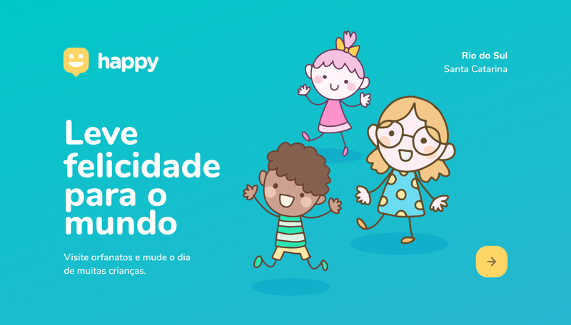

# Next Level Week | Happy 

#### By Rocketseat
Esse é o projeto proposto na NLW dessa semana 12/10 até 16/10

 - Dia 1 | 12/10/2020
	 - Primeiros passos no projeto
	 - Criação da landing-page
	 - Organização em pastas
	 - Estilização CSS
- Dia 2 | 13/10/2020
	- Mais páginas HTML criadas
	- Estilização CSS
	- Adição de Javascript
	- Galeria de imagens e mapa interativo adicionado
- Dia 3 | 14/10/2020
	- Mais HTML e CSS
	- Adição de formulário
	- Script Javascript para formulário
	- Organização e refatoração no CSS
- Dia 4 | 15/10/2020
	- Ínicio do Back-end com Node Js
	- Criação do servidor(Express Js)
	- Reorganização da estrutura do projeto
	- Uso do Handlebars Js(template engine)
	- Estrutura de dados
- Dia 5 | 17/10/2020
	- Ultimo dia do projeto Next Level Week
	- Aqui foi implementado o banco de dados com SQLite
	- Foram feitos os ajustes necessários no Front-end para pegar os dados do BD
 aula

E é isso, semana muito corrida porém vale a pena participar, pois muitos conceitos novos são descobertos! É um pouco difícil captar tudo o que é proposto quando se é iniciante, mas a graça ta aí. Quando eu fiz o meu primeiro NLW (Proffy), não entendi quase nada, nesse aqui já foi muito mais tranquilo(especialmente na parte front-end). 

Trilha Starter.
