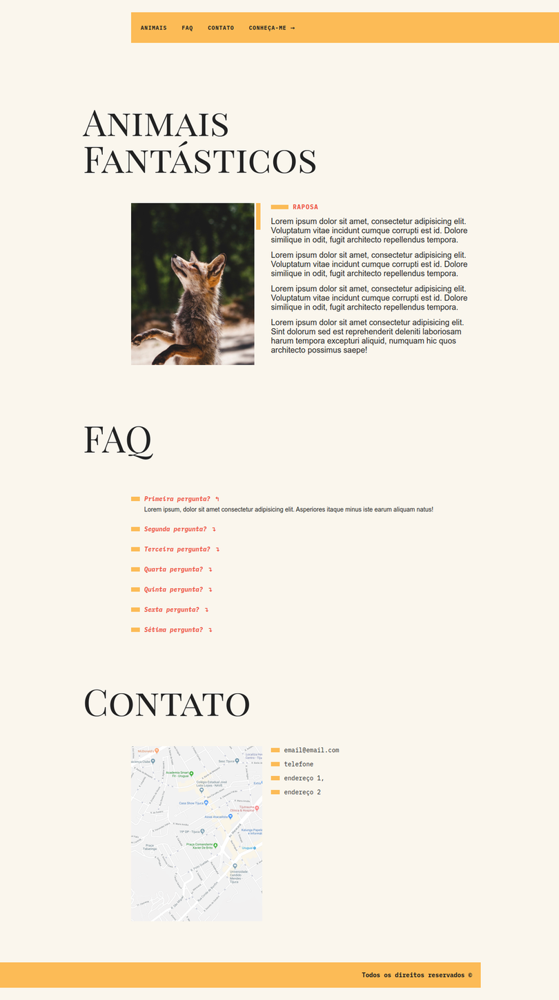

## Animais Fantásticos
>  Curso de Javascript da Origamid

A idéia é fazer várias manipulações no DOM através do JS Vanilla.

- Manipulações feitas até agora:
  - Exibir conteúdo das sections dos animais através do clique nas imagens
    - Como padrão, a primeira section ja vem ativa
  - Acordeão de texto na section FAQ
    - A primeira resposta também é exibida por padrão
  - Scroll suave através das sections do site
  - Junto com o scroll, há uma animação de entrada/saída lateral

- Como essas manipulações foram feitas?
  - Básicamente, utilizando o método ```querySelectorAll()``` 
  - Com esse método é possível "pegar" elementos do DOM
  - E a modificação dos elementos é feita através da integração com CSS
  - As funções basicamente adicionam ou removem classes dos elementos
  - Classes essas, que foram trabalhadas no CSS, para chegar no resultado desejado

<br>

---

### Print do site

> Todo o projeto veio do curso, apenas fiz pequenas modificações de estilo.

